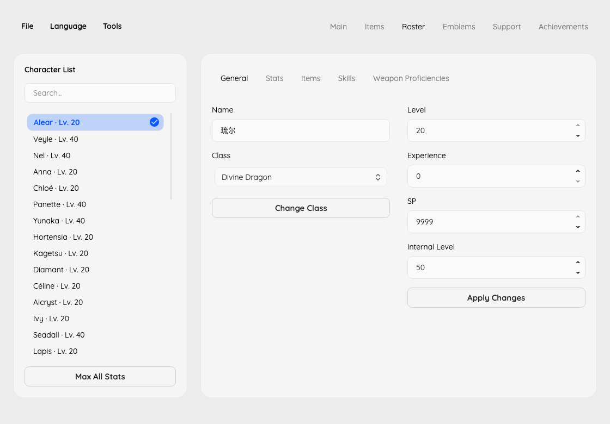

# FEE Save Editor

Edit Fire Emblem Engage saves, including DLC characters, Emblems and Bond Rings.



## Features

- **Main:** Four cards for game settings, resources, minigames and donations. Edit money, bond fragments, iron/steel/silver ingots, difficulty, game mode and Sommie's name. Edit strength-training high scores, wyvern high scores and saved evaluations, and each fish's catch count, best size and size rank. Choose a donation country, edit its level and linked donated amount, or maximize one or all four countries.
- **Items:** Search the convoy, add, replace or delete items, edit remaining uses and weapon refinement, and restore uses to each item's normal maximum. Assign or clear any of the 20 base-game/DLC Emblem engravings and preview their effects. Assigning an engraving transfers it from its previous weapon, including weapons held by a character.
- **Roster:** Edit character level, experience, SP, internal level and current HP. View character availability and restore an existing dead or lost playable character to the available bench with full HP, outside battle, without recruiting missing characters or rewriting story progress. Edit personal stat values with a live preview of current-class stats and caps, or maximize one character or the whole roster across their available classes. Change classes using character, gender and weapon-branch restrictions, including exclusive and DLC classes. Manage carried items and engravings, inherited skills, equipped skills, learned class skills and weapon proficiencies. Equip, transfer or unequip owned Emblems and Bond Rings without consuming copies. Export one character's editable data and import it into the same character in a compatible save, preserving recruitment, story and Emblem associations.
- **Emblems:** Add missing base-game Emblems and DLC Bracelets without resetting existing bonds. Edit character bond levels and linked experience, or maximize one or all character bonds for the selected Emblem. Manage Bond Ring quantities, fill missing S-rank rings, and meld unequipped duplicates using the game's ring and bond-fragment costs. Equipped copies are not consumed.
- **Support:** Search character pairs, edit their support rank and linked points, or maximize one or every existing pair. Rank choices follow each pair's thresholds; an existing Pact partner is preserved.
- **Achievements:** Browse 765 named achievements by category or search. Check whether an achievement is unfulfilled, has an available reward or has already been claimed. Unlock one or all achievements without resetting claimed rewards or changing bond fragments, activity counters or story progress.
- **Inspector:** Look up save-file information and search its sections from the Tools menu.

English is the default language. Switch to Simplified Chinese from the top menu; interface text and game-data names change together, including characters, classes, skills, items, rings and achievements.

## Get started

With the .NET 10 SDK installed, run:

```sh
dotnet run --project gui/FeeEditor.Gui.csproj -c Release
```

Open a `Manual0` or `Auto` save, make your edits, then save a copy to another folder. Keep the original until you have checked the edited copy in-game. `Global` saves can be inspected and copied but do not expose gameplay panels.

For scripted edits, see the [CLI guide](CLI.md).

## Credits

- [Xzonn/FireEmblemEngageData](https://github.com/Xzonn/FireEmblemEngageData): game-data tables used to build the catalogs.
- [delvier/Iron19_L10n](https://github.com/delvier/Iron19_L10n): English and Simplified Chinese game text.
- [laqieer/FE17-DOC](https://github.com/laqieer/FE17-DOC) and [LordMewtwo73/feEngage-randomizer](https://github.com/LordMewtwo73/feEngage-randomizer): save-format references and item, character, class and skill data.

## License

[MIT](./LICENSE) License © [jinghaihan](https://github.com/jinghaihan)
